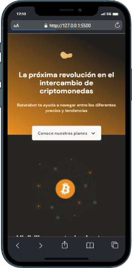

# Curso Mobile First (Platzi)
Curso de Responsive Design: Maquetación Mobile First

>Hola soy Yocsy, estudio desarrollo web, este proyecto fue realizado con html y css.🥰🤗

El 50% del tráfico en internet se realiza desde dispositivos móviles, convirtiendo una prioridad el desarrollar frontend para smartphones, tablets y laptops. 
En este curso de platzi aprendí cómo crear proyectos pensados para adaptarse a las distintas pantallas o vistas que utilicen tus usuarios.

**Este curso contempla** 👀
👉🏽 Crear y aplicar estilos con CSS que se puedan reutilizar
👉🏽 Realizar una auditoría con Lighthouse
👉🏽 Aplicar media queries para adaptar vistas de dispositivos
👉🏽 Analizar la arquitectura de tu proyecto partiendo de un wireframe

## Página Web   🌐
👉 [`URL`](https://yocselys.github.io/curso_mobile_first/)
## Demo

##

